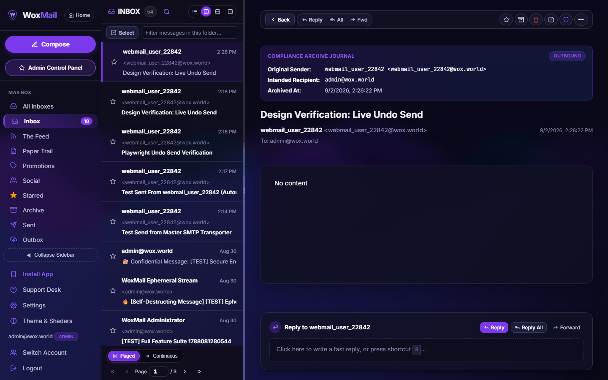
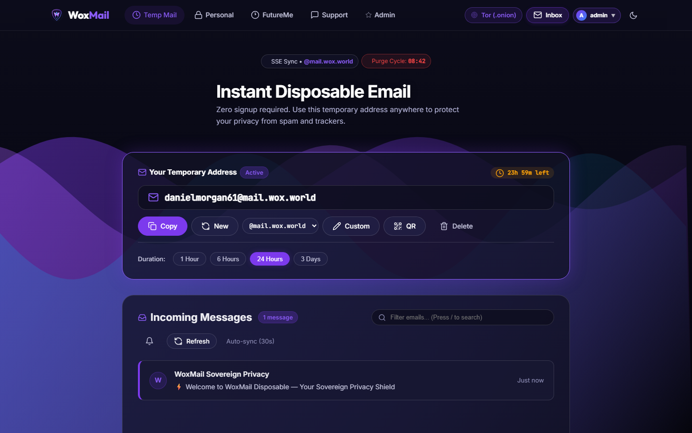
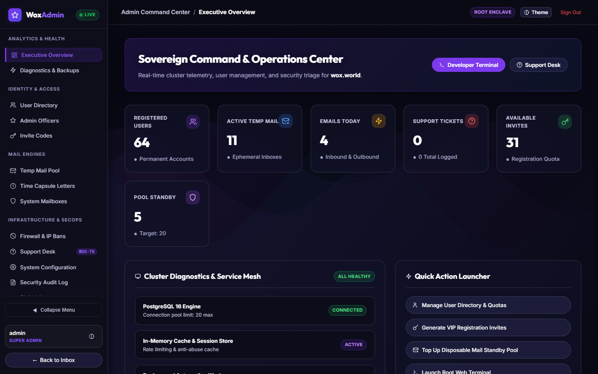
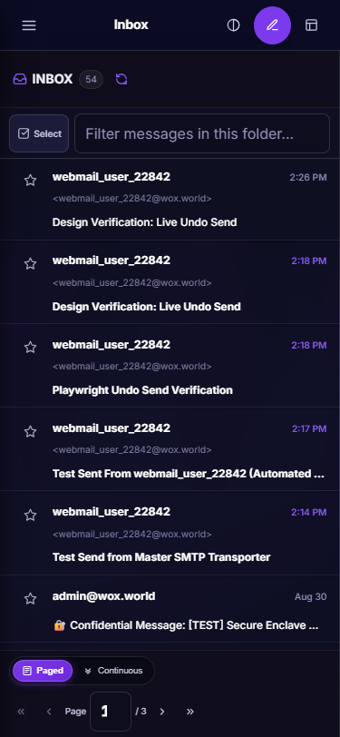

<p align="center">
  
</p>

<h1 align="center">WoxMail Sovereign Privacy Suite</h1>

<p align="center">
  <strong>Sovereign Encrypted Webmail, Disposable Temp Mail Enclave, FutureMe Time-Capsule Epistles, and Zero-Tracking Communications Infrastructure.</strong>
</p>

<p align="center">
  <a href="https://mail.wox.world"><strong>Live Web Deployment: mail.wox.world</strong></a> &bull;
  <a href="http://e6mph43cdahjoum7pbrs2gpzvb3edq3j2ob6hi5soihld4oid2fcwbad.onion"><strong>Tor Onion Service</strong></a> &bull;
  <a href="https://github.com/WizardOfXerox/WOX-Mail"><strong>GitHub Repository</strong></a>
</p>

<p align="center">
  
  
  
  
  
  
</p>

---

## Overview

WoxMail is a self-sovereign, privacy-centric email and messaging platform designed to eliminate data mining, tracking pixels, and vendor lock-in. It combines high-speed disposable temporary email addresses, sovereign permanent mailboxes, self-destructing encrypted messages, time-capsule letters to the future, and administrative telemetry into a unified system.

### Key Capabilities

- **Instant Disposable Temp Mail (`@mail.wox.world`)**: Sub-5ms in-memory standby pool with real-time Server-Sent Events (SSE) streaming, zero-JS fallback mode, and configurable expiry timers (1 to 72 hours).
- **Personal Password-Protected Temp Mail**: Long-lived disposable mailboxes (up to 60 days) secured with dedicated passcodes and IMAP/SMTP credentials.
- **Sovereign Webmail Client (`@wox.world`)**: Production webmail featuring J/K keyboard navigation, undo send countdown buffers, split-pane reading, thread grouping, folder management, and continuous scroll mode.
- **Confidential Messaging Enclave**: End-to-end encrypted burn-on-read messages with AES-256-GCM, Argon2id key derivation, PIN protection, and dynamic watermark overlays.
- **FutureMe Time-Capsule Epistles**: Write scheduled letters delivered years into the future with cryptographic token verification and public reflections wall.
- **Gatekeeper Sender Screener**: Quarantine first-contact senders and allow/block senders before they reach your primary inbox.
- **Native Device Configuration**: RFC 6186 & Autodiscover support with one-click Apple iOS/macOS `.mobileconfig` profiles, Mozilla Thunderbird XML autoconfig, and Microsoft Outlook POX protocols.
- **Tor Onion Routing**: Built-in darknet access via dedicated v3 `.onion` hidden service with automated Onion-Location headers.
- **Interactive Developer CLI**: Native command-line interface (`woxmail`) for reading, sending, temporary mailbox provisioning, and admin management directly from your terminal.

---

## User Interface & Screenshots

### Webmail Dashboard
Clean split-pane layout with folder navigation, instant search, undo-send toast notifications, and segmented Paged/Continuous mode controls.

<p align="center">
  
</p>

### Disposable Temp Mail
Instant temporary mailbox generation with live incoming stream, QR code sharing, and one-click address rotation.

<p align="center">
  
</p>

### Admin Control Center
Unified telemetry, user management, pool health, support ticket handling, and system audit logs.

<p align="center">
  
</p>

### Mobile & Tablet Optimized
Responsive viewport layouts with touch-friendly navigation, zero horizontal overflow, and glassmorphic styling.

<p align="center">
  
</p>

---

## WoxMail Command-Line Interface (CLI)

WoxMail includes a developer-grade command-line interface located in `bin/woxmail.js`.

### 1. Installation & Setup

To make the `woxmail` command globally accessible in your terminal, link it via npm:

```bash
# From the project root
npm link

# Verify installation
woxmail --help
```

Alternatively, you can run the CLI directly with Node:

```bash
node bin/woxmail.js <command>
```

### 2. Configuration

By default, the CLI connects to `http://localhost:3001` in development. You can configure it to point to your live sovereign deployment:

```bash
# Set target server URL
woxmail config set serverUrl https://mail.wox.world

# View current configuration
woxmail config
```

### 3. Authentication & Session

```bash
# Log in with your WoxMail credentials
woxmail login user@wox.world yourpassword

# Check active identity, role, and tier
woxmail whoami

# Clear local session token
woxmail logout
```

### 4. Reading & Sending Emails

```bash
# List emails in your inbox or specific folder
woxmail mail list INBOX
woxmail mail list Sent

# Read full email content by message UID
woxmail mail read 1042

# Send a standard email
woxmail mail send --to recipient@example.com --sub "Meeting Agenda" --body "Attached are the discussion notes."

# Send a confidential self-destructing message (PIN-protected)
woxmail mail secure --to recipient@example.com --pin 849201 --sub "Classified" --body "Confidential payload." --burn
```

### 5. Disposable Temporary Mailboxes

```bash
# Generate a new disposable email address valid for 24 hours
woxmail temp new 24

# Check incoming messages for a disposable address
woxmail temp inbox randomuser98@mail.wox.world
```

### 6. Cold Email Gatekeeper & Screener

```bash
# List screened first-contact senders waiting for approval
woxmail screener list

# Allow sender into primary inbox
woxmail screener allow sender@external.com

# Quarantine and block sender
woxmail screener block spammer@marketing.com
```

### 7. Support Desk & Broadcasting

```bash
# View open support tickets
woxmail tickets list

# Open a new support ticket
woxmail tickets new --sub "Account Inquiry" --body "Please enable extra storage."

# List broadcast newsletter campaigns
woxmail campaigns list
```

### 8. Administrator Commands

For users with Super Admin privileges:

```bash
# List registered users and tiers
woxmail admin users

# Check disposable pool availability and hot reserves
woxmail admin pool

# View server runtime statistics and memory telemetry
woxmail admin stats
```

---

## Local Development & Installation

### Prerequisites

- **Node.js**: `v20.0.0` or higher
- **PostgreSQL**: `16`
- **Redis**: `7` (optional; falls back to in-memory cache if absent)

### Step-by-Step Setup

1. **Clone the Repository**:
   ```bash
   git clone https://github.com/WizardOfXerox/WOX-Mail.git
   cd WOX-Mail
   ```

2. **Install Dependencies**:
   ```bash
   npm install
   ```

3. **Configure Environment Variables**:
   ```bash
   cp .env.example .env
   # Edit .env with your PostgreSQL credentials and secrets
   ```

4. **Run Database Migrations**:
   ```bash
   npm run migrate
   ```

5. **Build Client Workspace**:
   ```bash
   npm run build
   ```

6. **Start Development Server**:
   ```bash
   npm run dev
   ```

The webmail application will be available locally at `http://localhost:3001`.

---

## Running with Docker Compose

To start PostgreSQL and Redis containers automatically:

```bash
docker-compose up -d
npm run migrate
npm run dev
```

---

## Architecture

```
                    +--------------------------------+
                    |    Cloudflare / Tor Ingress    |
                    +---------------+----------------+
                                    |
                    +---------------v----------------+
                    |   Express + Socket.IO Server   |
                    |         (Node.js 20+)          |
                    +---+-----------+------------+---+
                        |           |            |
            +-----------v+   +------v-----+   +--v------------+
            | PostgreSQL |   |   Redis    |   |  Purelymail   |
            | 16 Engine  |   |  7 Memory  |   |  (IMAP/SMTP)  |
            +------------+   +------------+   +---------------+
```

- **Server**: Express.js with custom router modules, SSE event bus, and background cron cleaners.
- **Client**: React 18 islands integrated into EJS base views with Vite multi-entry bundling.
- **Styles**: Native CSS tokens with dark-first palette, customizable GPU shaders, and glassmorphism.
- **Security**: CSP, CSRF tokens, DOMPurify HTML sanitizer, Argon2id hashing, and rate limiting.

---

## Deployment & Production

- **Live Production URL**: [https://mail.wox.world](https://mail.wox.world)
- **Tor Onion Service**: `http://e6mph43cdahjoum7pbrs2gpzvb3edq3j2ob6hi5soihld4oid2fcwbad.onion`

---

## License

Private and Sovereign &bull; All Rights Reserved &bull; [WizardOfXerox](https://github.com/WizardOfXerox)
